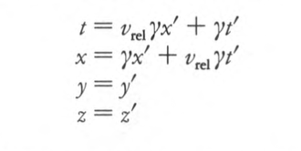

### Week 3 &mdash; Time Dilation &mdash; The Relativity of Simultaneity &mdash; Length Contraction

* Monday, Sep. 9 &mdash; Read and be prepared to discuss *Spacetime Physics* to p. 65 &mdash; Problem Set 3 to be turned in at the beginning of Monday's class is [here](./assignments/ProblemSet03.nb.pdf) and in your file folders &mdash; [Maclaurin and Taylor series graphs](./resources/MaclaurinAndTaylorSeries.pdf) &mdash; Theory behind the coefficients in the Maclaurin and Taylor Series &mdash; Overview of the three biggest consequences of special relativity: (1) Time Dilation, (2) Length Contraction, (3) The Relativity of Simultaneity &mdash; Derivation of the first effect: Time Dilation (Kel and Jeremy) &mdash; The &gamma; factor notation &mdash; Invariance of the transverse dimension via the Rockets-with-Paintbrushes thought experiment &mdash; The Relativity of Simultaneity via Einstein&apos;s Lightning-Strikes-Train thought experiment
* Thursday, Sep. 12 &mdash; Read and be prepared to discuss *Spacetime Physics* to p. 77 (the end of Chapter 3) &mdash; Problem Set 4 to be turned in at the beginning of Thursday's class is [here](./assignments/ProblemSet04.nb.pdf) and in your file folders &mdash; Derivation of Length Contraction by Sasha and Eli &mdash; [Length contraction board photo](./resources/LengthContractionBoardPhoto.pdf) &mdash; [Rania&apos;s Length Contraction handout](./resources/RaniasLengthContractionWriteup.pdf) &mdash; The Pole-in-the-Barn Paradox &mdash; A Relativity of Simultaneity derivation using [a variant of Einstein&apos;s Lightning-Strikes-Train thought experiment](./resources/LightningStrikesTrain.pdf)

### Week 4 &mdash; Presentations of Interesting Problems &mdash; Start The Lorentz Transformation Formulas

* Monday, Sept. 16 &mdash; To give you time to consolidate the first three chapters, there is no new reading assignment due for Friday &mdash; Instead of a problem set, you will split into three groups, each to prepare a presentation on an end-of-Chapter-3 problem of the three groups' choice, 20 minutes per presentation, plus 5 minutes Q&A per presentation &mdash; Please make sure these are of high quality, *including preparing and making copies for everyone* of a handout if you think that will assist in the amount of understanding that will be transmitted
* Thursday, Sept. 19 &mdash; Read Chapter L to p. 102, which is the derivation of the Lorentz Transformation formulas summarized in Eq. L-10a on p. 102 &mdash; Problem Set 5 to be turned in at the beginning of Thursday's class is [here](./assignments/ProblemSet05.nb.pdf) and in your file folders

### Week 5 &mdash; Finish The Lorentz Transformation Formulas &mdash; Exam 1

* Monday, Sept. 23 &mdash; Finish Chapter L
* Thursday, Sept. 26 &mdash; Exam 1

