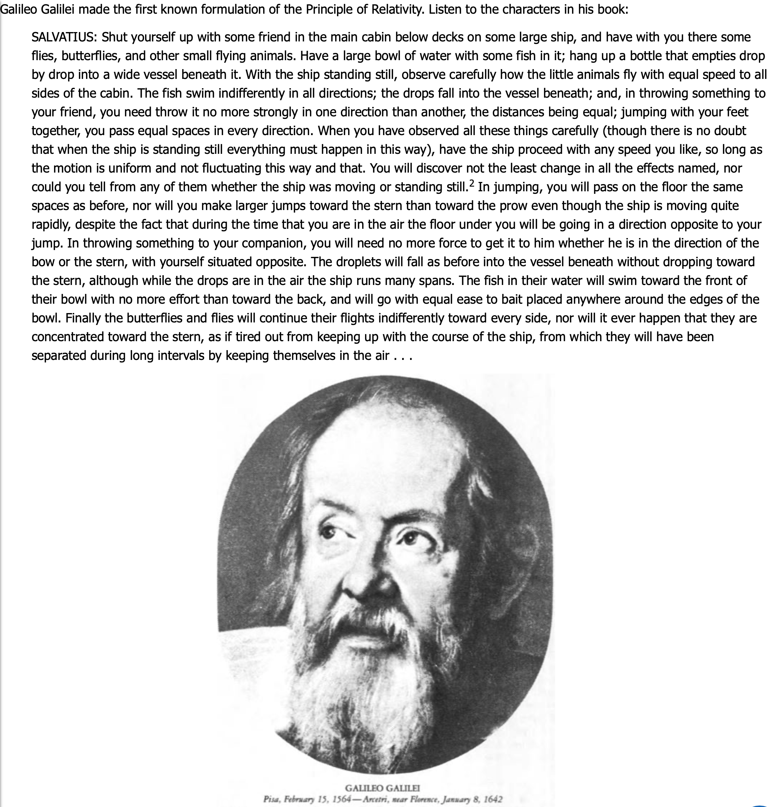

# Black Holes

Course [home page](./)

## Daily Schedule Term 2

*Very generously, Taylor, Wheeler &amp; Bertschinger have made PDFs of the textbooks we will be using completely free. See links below.*

* [*Spacetime Physics, 2nd Edition*, https://www.eftaylor.com/spacetimephysics/](https://www.eftaylor.com/spacetimephysics/)
* [*Exploring Black Holes, 2nd Edition*, https://www.eftaylor.com/exploringblackholes/](https://www.eftaylor.com/exploringblackholes/)

### Week 1

* Thursday, Aug. 29 &mdash; Read pp. 1-15 of Chapter 1 of *Spacetime Physics, 2nd Edition* &mdash; All of Chapter 1 is already printed out for you across from the copier in your file folders &mdash; Go to the excercises at the end of the Chapter and choose an exercise to work out and present &mdash; Don't all choose the same exercise! &mdash; Also read the two-page handout on Galilean relativity &mdash; Sorry for the teeny font! &mdash; I will open by presenting Cartesian coordinate systems, speed, velocity, and Galilean Relativity.

