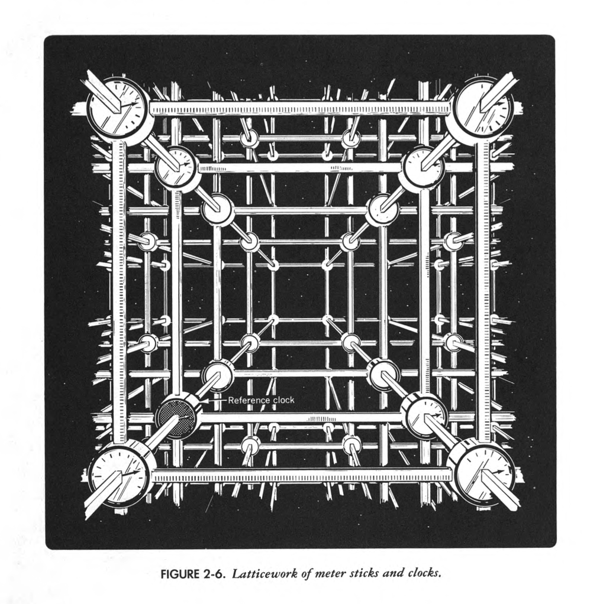

# Black Holes

Course [home page](./)

## Daily Schedule Term 2

### Week 1 &mdash; Galilean Relativity &mdash; Invariance of the Interval

* Thursday, Aug. 29 &mdash; We did a [calculus self-assessment](./exams/Exam0.nb.pdf) &mdash; We went over the [syllabus](./BlackHolesSyllabus.pdf) &mdash; You read pp. 1-15 of Chapter 1 of *Spacetime Physics, 2nd Edition* &mdash; Go to the excercises at the end of the Chapter and choose an exercise to work out and present (we chose to present 1-3 and 1-4) &mdash; Also read what Galileo's character [Salvatius has to say](./resources/GalileanRelativity-Salvatius.png) about Galilean relativity &mdash; I have written up and will talk you through [my own introduction](./resources/GalileanRelativity-Brian.pdf) to speed, velocity, and Galilean Relativity which is less elegant than Galileo's but uses the reliable crutch of Cartesian coordinate systems

### Week 2 &mdash; Free-Float Frames &mdash; Time Dilation Illustrated in Muon and Pion Decay

* Monday, Sep. 2 &mdash; Read and be prepared to discuss *Spacetime Physics* to p. 30 &mdash; Problem Set 1 to be turned in at the beginning of Monday's class is [here](./assignments/ProblemSet01.nb.pdf) and in your file folders &mdash; I played [Chris Hadfield's cover of David Bowie's &ldquo;A Space Oddity&rdquo;](https://youtu.be/KaOC9danxNo) as an important illustration of what it is like to be in a free-float frame &mdash; I proved [Galilean Addition of Velocities](./resources/GalileanAdditionOfVelocities.pdf) which establishes the near impossibility that the speed of light could possibly be constant &mdash; And yet the speed of light is constant in any frame(!), and this follows easily from the invariance of the interval
* Thursday, Sep. 5 &mdash; Read and be prepared to discuss *Spacetime Physics* to the end of Chapter 2 (to p. 44) &mdash; I will use the first two terms of the Maclaurin series to present an important approximation method that you will be using a lot &mdash; Then two groups will present their detailed analyses of the falling railway coach &mdash; [Here are the variables](resources/HorizontalCoachVariables.png) for analyzing the horizontal problem (Rania and Rebecca), and [here are similar variables](resources/VerticalCoachVariables.png) for analyzing the vertical problem (Walker, Will, and Eden) &mdash; Both groups should be seeking approximate expressions for *d(t)* where initially *d(t)=dI*, and we are really only interested in what happens in a short time *&Delta;t* &mdash; Problem Set 2 to be turned in at the beginning of Thursday's class is [here](./assignments/ProblemSet02.nb.pdf) and in your file folders

### Week 3 &mdash; Time Dilation &mdash; The Relativity of Simultaneity &mdash; Length Contraction

* Monday, Sep. 9 &mdash; Read and be prepared to discuss *Spacetime Physics* to p. 65 &mdash; Problem Set 3 to be turned in at the beginning of Monday's class is [here](./assignments/ProblemSet03.nb.pdf) and in your file folders &mdash; [Maclaurin and Taylor series graphs](./resources/MaclaurinAndTaylorSeries.pdf) &mdash; Theory behind the coefficients in the Maclaurin and Taylor Series &mdash; Overview of the three biggest consequences of special relativity: (1) Time Dilation, (2) Length Contraction, (3) The Relativity of Simultaneity &mdash; Derivation of the first effect: Time Dilation (Kel and Jeremy) &mdash; The &gamma; factor notation &mdash; Invariance of the transverse dimension via the Rockets-with-Paintbrushes thought experiment &mdash; The Relativity of Simultaneity via Einstein's Lightning-Strikes-Train thought experiment
* Thursday, Sep. 12 &mdash; Read and be prepared to discuss *Spacetime Physics* to p. 77 (the end of Chapter 3) &mdash; Problem Set 4 to be turned in at the beginning of Thursday's class is [here](./assignments/ProblemSet04.nb.pdf) and in your file folders &mdash; Derivation of Length Contraction by Sasha and Eli &mdash; [Length contraction board photo](./resources/LengthContractionBoardPhoto.pdf) &mdash; [Rania&rsquo;s Length Contraction writeup](./resources/RaniasLengthContractionWriteup.pdf) &mdash; The Pole-in-the-Barn Paradox &mdash; A Relativity of Simultaneity derivation using [a variant of Einstein's Lightning-Strikes-Train thought experiment](./resources/LightningStrikesTrain.pdf)

### Week 4 &mdash; Presentations of Interesting Problems &mdash; The Lorentz Transformation Formulas

* Monday, Sept. 16 &mdash; To give you time to consolidate the first three chapters, there is no new reading assignment due for Friday &mdash; Instead of a problem set, you will split into three groups, each to prepare a presentation on an end-of-Chapter-3 problem of the three groups' choice, 20 minutes per presentation, plus 5 minutes Q&A per presentation &mdash; Please make sure these are of high quality, *including preparing and making copies for everyone* of a handout if you think that will assist in the amount of understanding that will be transmitted
* Thursday, Sept. 19 &mdash; Read Chapter L, The Lorentz Transformation Formulas &mdash; Problem Set 5 to be turned in at the beginning of Thursday's class is [FORTHCOMING](./assignments/ProblemSet05.nb.pdf) and will be in your file folders

### Week 5 &mdash; Exam 1

* Monday, Sept. 23 &mdash; Exam 1

