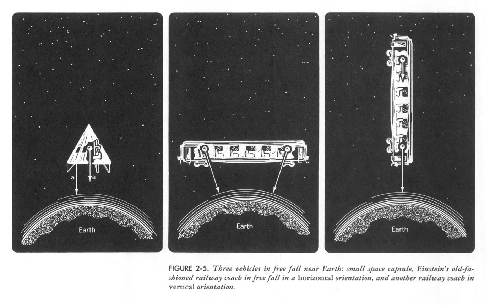

# Black Holes

Course [home page](./)

## Daily Schedule Term 2

*Very generously, Taylor, Wheeler &amp; Bertschinger have made PDFs of the textbooks we will be using completely free. See links below.*

* [*Spacetime Physics, 2nd Edition*, https://www.eftaylor.com/spacetimephysics/](https://www.eftaylor.com/spacetimephysics/)
* [*Exploring Black Holes, 2nd Edition*, https://www.eftaylor.com/exploringblackholes/](https://www.eftaylor.com/exploringblackholes/)

### Week 1 &mdash; Galilean Relativity &mdash; Invariance of the Interval

* Thursday, Aug. 29 &mdash; We did a [calculus self-assessment](./exams/Exam0.nb.pdf) &mdash; We went over the [syllabus](./BlackHolesSyllabus.pdf) &mdash; You read pp. 1-15 of Chapter 1 of *Spacetime Physics, 2nd Edition* &mdash; Go to the excercises at the end of the Chapter and choose an exercise to work out and present (we chose to present 1-3 and 1-4) &mdash; Also read what Galileo's character [Salvatius has to say](./resources/GalileanRelativity-Salvatius.png) about Galilean relativity &mdash; I have written up and will talk you through [my own introduction](./resources/GalileanRelativity-Brian.pdf) to speed, velocity, and Galilean Relativity which is less elegant than Galileo's but uses the reliable crutch of Cartesian coordinate systems

### Week 2 &mdash; Free-Float Frames

* Monday, Sep. 2 &mdash; Read and be prepared to discuss *Spacetime Physics* to p. 30 (you can stop after examining Figure 2-5) &mdash; Problem Set 1 to be turned in at the beginning of Monday's class is [here](./assignments/ProblemSet01.nb.pdf) and in your file folders &mdash; I played [Chris Hadfield's cover of David Bowie's &ldquo;A Space Oddity&rdquo;](https://youtu.be/KaOC9danxNo) as an important illustration of what it is like to be in a free-float frame &mdash; I proved [Galilean Addition of Velocities](./resources/GalileanAdditionOfVelocities.pdf) which establishes the near impossibility that the speed of light could possibly be constant &mdash; And yet the speed of light is constant in any frame(!), and this follows easily from the invariance of the interval
* Thursday, Sep. 5 &mdash; Read and be prepared to discuss *Spacetime Physics* to the end of Chapter 2 (to p. 44) &mdash; Two groups will present their detailed analyses of the falling railway coach &mdash; [Here are the variables](resources/HorizontalCoachVariables.png) for analyzing the horizontal problem (Rania and Rebecca), and [here are similar variables](resources/VerticalCoachVariables.png) for analyzing the vertical problem (Walker, William, and Eden) &mdash; Both groups should be seeking approximate expressions for *d(t)* where initially *d(t)=dI*, and we are really only interested in what happens in a short time *&Delta;t* &mdash; Problem Set 2 to be turned in at the beginning of Thursday's class is [here](./assignments/ProblemSet02.nb.pdf) and in your file folders

