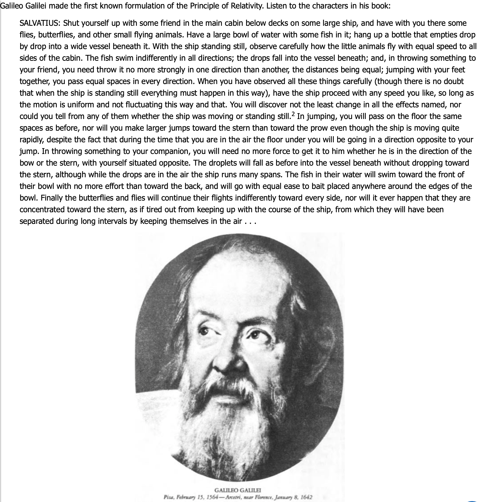

# Black Holes

Course [home page](./)

## Daily Schedule Term 2

*Very generously, Taylor, Wheeler &amp; Bertschinger have made PDFs of the textbooks we will be using completely free. See links below.*

* [*Spacetime Physics, 2nd Edition*, https://www.eftaylor.com/spacetimephysics/](https://www.eftaylor.com/spacetimephysics/)
* [*Exploring Black Holes, 2nd Edition*, https://www.eftaylor.com/exploringblackholes/](https://www.eftaylor.com/exploringblackholes/)

### Week 1

* Thursday, Aug. 29 &mdash; We did a [calculus self-assessment](./exams/Exam0.nb.pdf) &mdash; We went over the [syllabus](./BlackHolesSyllabus.pdf) &mdash; You read pp. 1-15 of Chapter 1 of *Spacetime Physics, 2nd Edition* &mdash; Go to the excercises at the end of the Chapter and choose an exercise to work out and present (we chose to present 1-3 and 1-4) &mdash; Also read what Galileo's character [Salvatius has to say](./resources/GalileanRelativity-Salvatius.png) about Galilean relativity &mdash; I have written up and will talk you through [my own introduction](./resources/GalileanRelativity-Brian.pdf) to speed, velocity, and Galilean Relativity which is less elegant than Galileo's but uses the reliable crutch of Cartesian coordinate systems

