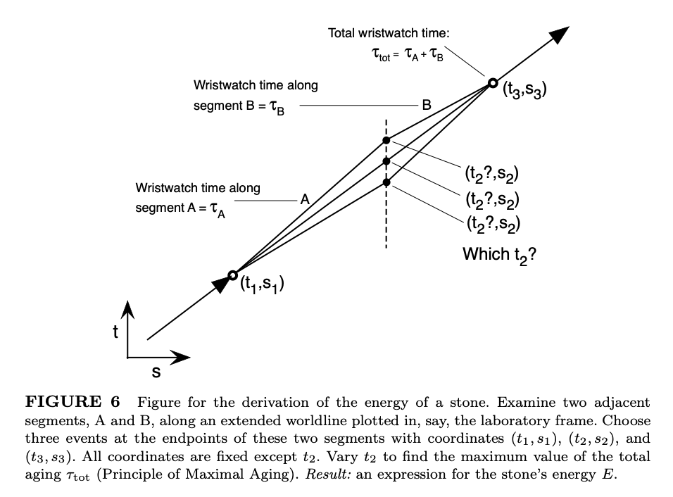

# Black Holes

Course [home page](./)

See also: [Daily Schedule Term 2](./daily_schedule_term_2.html)

## Daily Schedule Term 3

### Week 8 &mdash; Relativistic Momentum and Energy

* Monday, Oct. 28 &mdash; No class (last day of Term 2-3 break)
* Thursday, Oct. 31 &mdash; Continue your study of Chapter 7 of *Spacetime Physics* to the end of Section 7.5, p. 206 &mdash; Problem Set 8, with due date delayed to the beginning of this Thursday's class, is [here](./assignments/ProblemSet08.nb.pdf)

### Week 9 &mdash; Start *Exploring Black Holes*

NOTE: For the rest of Term 3, we will devote ourselves to covering at least half of *Exploring Black Holes,* [https://www.eftaylor.com/exploringblackholes/](https://www.eftaylor.com/exploringblackholes/). The link is to the 2nd edition. Since all of you have physical copies of the first edition, page numbers below refer to the first edition. To my mind, the first edition is actually the better edition, because the material in the 2nd edition that was added is too advanced for our purposes. One can always simply skip that material, but the simplicity and elegance of the text is obscured.

* Monday, Nov. 4 &mdash; Study Chapter 1 of *Exploring Black Holes* through Section 1-7, p. 1-13 (please don't forget that in the mid-semester evaluation one thing we picked to try was making bringing a question from the reading mandatory) &mdash; Problem Set 9 is [here](./assignments/ProblemSet09.nb.pdf) and in your file folders and two groups of you have volunteered for presentations as noted in the problem set

