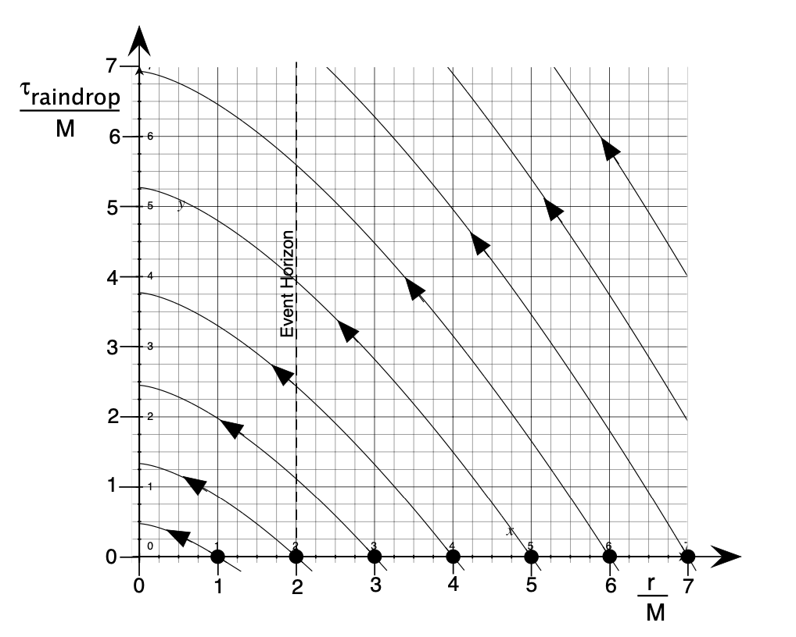

# Black Holes

Course [home page](./)

See also: [Daily Schedule Term 2](./daily_schedule_term_2.html)

## Daily Schedule Term 3

### Week 8 &mdash; Relativistic Momentum and Energy

* Monday, Oct. 28 &mdash; No class (last day of Term 2-3 break)
* Thursday, Oct. 31 &mdash; Continue your study of Chapter 7 of *Spacetime Physics* to the end of Section 7.5, p. 206 &mdash; Problem Set 8, with due date delayed to the beginning of this Thursday's class, is [here](./assignments/ProblemSet08.nb.pdf)

### Week 9 &mdash; Start *Exploring Black Holes* &mdash; Spherical Polar Coordinates &mdash; Reduced Radius &mdash; Schwarzschild Metric

* Monday, Nov. 4 &mdash; Study Chapter 1 of *Exploring Black Holes* through Section 1-7, p. 1-13 &mdash; Problem Set 9 is [here](./assignments/ProblemSet09.nb.pdf) and in your file folders and two groups of you have volunteered for presentations as noted in the problem set &mdash; Discussion of the Principle of Extremal Aging &mdash; Spherical polar coordinates &mdash; The &ldquo;reduced&rdquo; radius
* Thursday, Nov. 7 &mdash; Study Chapter 2 of *Exploring Black Holes* through p. 2-20 &mdash; Problem Set 10 is [here](./assignments/ProblemSet10.nb.pdf) and in your file folders and a group (consisting of Eden and Sasha) will present the full Black Hole Company Construction Problem

### Week 10 &mdash; Finish Introducing the Schwarzschild Metric

* Monday, Nov. 11 &mdash; Problem Set 11 is [here](./assignments/ProblemSet11.nb.pdf) and in your file folders &mdash; Finish reading Chapter 2 &mdash; We discussed the relation between E, p, h, &lambda;, and &nu; for photons, and contrasted it with the relation between E, p, and m for massive particles* &mdash; Presentation: Walker and Rebecca, the Zeno's Paradox problem
* Thursday, Nov. 14 &mdash; Problem Set 12 is [here](./assignments/ProblemSet12.nb.pdf) and in your file folders &mdash; No new reading assignment (just continue to consolidate your understanding of Chapter 2) &mdash; Presentation: Eli and Eden, the Chesapeake Bay problem

### Week 11 &mdash; Exam 2 &mdash; Start Plunging

* Monday, Nov. 18 &mdash; [Exam 2](./exams/Exam2.nb.pdf) covering everything from Chapter 4 to Section 7.5 of *Spacetime Physics*, and Chapters 1 and 2 of *Exploring Black Holes*
* Thursday, Nov. 21 &mdash; Study Chapter 3 through Section 3-6 (through p. 3-18) &mdash; We need two groups of two presenters from among those that didn't present the last two times, so that would be Jeremy, Kel, Rania, and Sasha &mdash; The two topics I can imagine being good to present are Sample Problem 2 (p. 3-22) and Sample Problem 3 (p. 3-25) &mdash; Problem Set 13 is [here](./assignments/ProblemSet13.nb.pdf) and in your file folders

### Week 12 &mdash; Finish Plunging &mdash; Start Rain Coordinates

* Monday, Nov. 25 &mdash; Finish your study of Chapter 3 (pp. 3-19 to 3-26) and then continue to page B-13 of Chapter B &mdash; Problem Set 14 is [here](./assignments/ProblemSet14.nb.pdf) and in your file folders
* Thursday, Nov. 28 &mdash; No class - Shakespeare Festival

### Week 13 &mdash; Finish Rain Coordinates &mdash; Start Orbiting

* Monday, Dec. 2 &mdash; Finish Rain Coordinates &mdash; Rebecca requested we read the material referenced at the end of Problem 6 on p. 3-30 of *Exploring Black Holes* &mdash; Specifically, the material referenced was pp. 422-448 of *Black Holes and Time Warps,* by Kip Thorne &mdash; Also read the remainder of Chapter B of *Exploring Black Holes* for Monday &mdash; Problem Set 15 for Monday (that does nothing more than flesh out the readings a bit) is [here](./assignments/ProblemSet15.nb.pdf) and in your file folders
* Thursday, Dec. 5 &mdash; Start Orbiting

### Week 14 &mdash; Finish Orbiting

* Monday, Dec. 9 &mdash;
* Thursday, Dec. 12 &mdash;

### Week 15 &mdash;

* Monday, Dec. 16 &mdash; Exam 3
* Thursday, Dec. 19 &mdash; Bonus Final Topic &mdash; TBD

